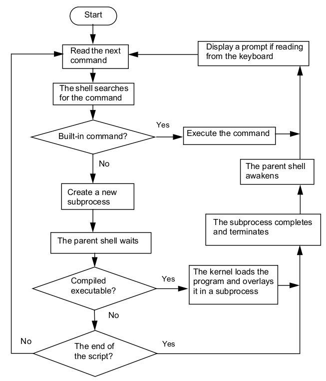

# 0x16. C - Simple Shell
## About
The shell is the Linux command line interpreter. It provides an interface between the user and the kernel and executes programs called commands. For example, if a user enters `ls` then the shell executes the `ls` command.

This project, `simple_shell`, is a custom implementation of a simple UNIX shell , the following functions have been implemented: `execve, exit, fork, free, getline, malloc, perror, stat, wait, write.`

## Table of Contents
* [About](#About)
* [File Descriptions](#File-Descriptions)
* [Requirements](#Requirements)
* [More Info and Examples](#More-Info-and-Examples)
	* [Installation](#Installation)
	* [Examples](#Examples)
* [Mandatory Tasks](#Mandatory-Tasks)
* [Advanced Tasks](#Advanced-Tasks)
* [Bugs](#Bugs)
* [Authors](Authors)
* [License](#License)

## File Descriptions
* [AUTHORS](AUTHORS) - It lists the contributors of this project
* [man_1_simple_shell](man_1_simple_shell) - The Manual describing usage of the simple_shell
* [shell.h](shell.h) - The header file used in this project

## Requirements
General
Allowed editors: vi, vim, emacs
All files were compiled on Ubuntu 20.04 LTS using gcc, using the options -Wall -Werror -Wextra -pedantic -std=gnu89
Betty coding style is followed.
The simple shell has no known memory leaks
### General
 - Allowed editors: vi, vim, emacs
 - All files were compiled on Ubuntu 20.04 LTS using gcc, using the options `-Wall -Werror -Wextra -pedantic -std=gnu89`
 - Betty coding style is followed.
 - The simple shell has no known memory leaks

## More Info and Examples
### Installation
Designed to run on `Ubuntu 20.04 LTS`, the simple_shell can be installed as follows:
 * Clone the current repository with the command: ```git clone ```
 * `cd` in to the cloned directory: ```cd simple_shell```
 * Create an executable using: ```gcc -Wall -Werror -Wextra -pedantic *.c -o hsh```
 * Run the executable either in interative mode `./hsh` or non-interactive mode `echo "pwd" | ./hsh`

### Examples
Example of error with sh:
```
$ echo "qwerty" | /bin/sh
/bin/sh: 1: qwerty: not found
$ echo "qwerty" | /bin/../bin/sh
/bin/../bin/sh: 1: qwerty: not found
$
```
Same error with our program hsh:
```
$ echo "qwerty" | ./hsh
./hsh: 1: qwerty: not found
$ echo "qwerty" | ./././hsh
./././hsh: 1: qwerty: not found
$
```
## Mandatory Tasks
 - [x] 0. README, man, AUTHORS
 - [x] 1. Betty would be proud
 - [x] 2. Simple shell 0.1
 - [x] 3. Simple shell 0.2
 - [x] 4. Simple shell 0.3
 - [x] 5. Simple shell 0.4
 - [x] 6. Simple shell 1.0
## Advanced Tasks
 - [x] 7. What happens when you type `ls -l \*.c` in the shell
## Bugs
No known bugs exists within the program as of this writing.

## Authors
Hazem Ouni| [@jordiindahood](https://github.com/jordiindahood)

Azza Guesmi | [@azzaguesmi00](https://github.com/azzaguesmi00)

## License
Given the open source nature of the project, no special licenses or license whatsoever is needed to use, modify, and redistribute the simple_shell program.

## FlowChart
